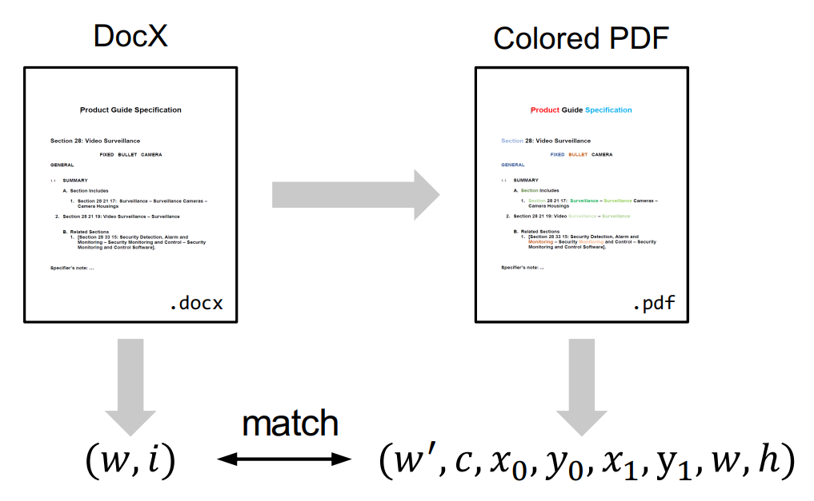

Notes from papers
LayoutReader: Pre-training of Text and Layout for Reading Order Detection 2021
What : 
Dataset: we propose ReadingBank, a benchmark dataset with 500,000 real-world document images for reading order detection. Distinct from the conventional human-labeled data, the proposed method obtains high-quality reading order annotations in a simple but effective way with automated metadata extraction.

LayoutReader: We further propose LayoutReader, a novel reading order detection model in which the seq2seq model is used by encoding the text and layout information(ip) and generating the index sequence in the reading order(op)

How :
Dataset( ReadingBank): 
Document collection > crawl word(docs) –>choose english lang. Docs(using language detection API) –>  each page words>50 
210,000 WORD documents in English and each page in the documents further randomly select
500,000 pages to build our dataset.
Reading Sequence Extraction >The reading order in ReadingBank refers to the order of words in the DocX files

    1. Each DocX file is a compressed archive where its word sequence can be parsed from its internal Office XML code. We adopt an open-source tool python-docx3 to parse the DocX file and extract the word sequence from the XML metadata.The tool also enables us to change the words’ color for the layout alignment step.
    2. We first extract the paragraphs and the tables sequentially from the parsing result. 
    3. Then we traverse the paragraphs line by line and the tables cell by cell and obtain the word sequence in the DocX file
We denote the sequence as [w1, w2, ..., wn], where n is the number of words in this document. The obtained sequence is the reading order without the layout information and is denoted as the Reading Sequence. 

r = i&0x110000 g = i&0x001100 b = i&0x000011 
C(i) = (R : r, G : g, B : b)

Layout Alignment with Coloring Scheme
Color docx files ===> convert to pdf  then perse using MuPDF5 —-> extract the boundary box We extract the words, bounding box coordinates, word color from the PDF file

Evaluation:
Important notes:
We observe that the reading order of WORD documents is embedded in their XML metadata; meanwhile, it is easy to convert WORD documents to PDFs or images. 

ReadingBank, a benchmark dataset that contains reading order, text, and layout information for 500,000 document images covering a wide spectrum of document types.

proposed LayoutReader captures the text and layout information for reading order prediction using the seq2seq model.

Most OCR engines arrange the recognized tokens or text lines in a top-to-bottom and left-to-right way. And give an unacceptable reading order for multi-column templates, forms, invoices, and many others 

Typically, the WORD documents have two formats: the binary format (Doc files) and the XML format (DocX files ), reading order information is embedded in the XML metadata so docs is used

We convert the Word documents into PDF format so that the 2D bounding box of each word can be easily extracted using any off-the-shelf PDF parser. Finally, we apply a carefully designed coloring scheme to align the text in the XML metadata with the bounding boxes in PDFs.

training set includes 400,000 document pages and both the validation set and the test set include 50,000 document pages, respectively

(w, i) ↔ (w0 , c, x0 , y0 , x1 , y1 , W, H)

subject to w = w0 ; c = C(i)

where w and w0 are the word in DocX and PDF,respectively; i is the appearance index of w; c is the word color recognized by PDF parser; x0 , y0 ,x1 , y1 are the left-top and right-bottom coordinates; W , H are the width and height of the page where the word locates.

LayoutReader:

